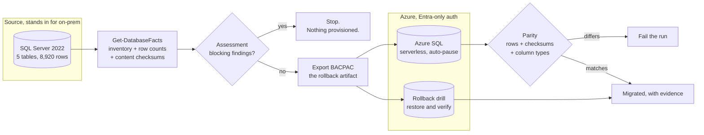

# SQL migration with a tested rollback

A SQL Server database migrated to Azure SQL by a pipeline that **refuses to proceed if the source is not migratable, proves the target matches the source, and restores the rollback artifact to show it works.**

Most migration tooling answers "did it finish?". The interesting question is "is it right, and what happens if it isn't?" — so the work here is in the assessment that runs *before* anything is provisioned, the parity check that compares content rather than counting rows, and a rollback drill that restores the pre-migration backup and verifies it.



## What this demonstrates

| Area | How it's done here |
|---|---|
| **Assessment as a gate, not a report** | Compatibility runs before any Azure resource exists. An assessment that runs after the bill has started is a report; this one stops the migration. |
| **Parity proven by content** | A truncated column or mangled encoding moves every row and leaves the count identical. Each table carries a checksum over its rows and a column signature, so type drift and content corruption are caught, not just missing rows. |
| **Rollback that has been tested** | The pre-migration BACPAC is restored into a database of its own and compared against the original facts. A backup nobody has restored is a hope, not a plan. |
| **No password anywhere** | The Azure server permits no SQL logins at all: Entra is the only way in. The source container's password is generated per run and masked. The deploy identity is federated to GitHub with no stored secret. |
| **Exposure measured in minutes** | The server is created with no firewall rules. The migration opens a pinhole for the runner's own address and closes it in the same run, under `always()`, so a failed migration cannot leave it reachable. |
| **The expensive path tested cheaply** | CI runs the entire pipeline — assess, export, migrate, verify, rollback drill — against a real SQL Server container using two databases, on every push, for nothing. The Azure run repeats the same sequence and confirms it. |

## The source is deliberately imperfect

Real databases being migrated carry baggage, and an assessment that finds nothing proves nothing. The seeded source includes:

| Finding | Severity | Why it is there |
|---|---|---|
| `dbo.Products.Notes` uses `NTEXT` | Warning | Deprecated since 2005, and it cannot be read by `BINARY_CHECKSUM`, so the parity check has to exclude it and say so |
| `dbo.AuditLog` is a heap | Warning | No clustered index; common in older estates |
| `dbo.AuditLog` has no primary key | Warning | Row identity cannot be proven after migration |

Warnings are reported and do not stop the migration. A gate that blocked a migration because a legacy table is a heap would never survive contact with a real estate. Blocking findings — shell execution, four-part names, ad hoc distributed queries, FILESTREAM, CLR, Service Broker — do stop it, because those fail in production rather than at import.

## Evidence, not assertion

Every run keeps its reasoning as build artifacts:

```
source-facts.json     what the source contained, before anything was touched
assessment.json       findings, by severity
target-facts.json     what arrived
parity.json           every difference, or none
rollback-parity.json  the restored artifact, compared to the source
```

Because the facts are files, a parity check can be re-run later from the evidence without touching a live server.

## Repository layout

```
source/               Schema and deterministic seed for the source database
module/SqlMigration/  Assessment and parity logic; connects to nothing
scripts/
  Get-DatabaseFacts.ps1     The only script that talks to SQL
  Invoke-Assessment.ps1     Facts in, gate out
  Export-Bacpac.ps1         Produces the rollback artifact
  Import-Bacpac.ps1         Used to migrate, and again to drill
  Test-MigrationParity.ps1  Compares two facts files
  Invoke-RollbackDrill.ps1  Restores the artifact and verifies it
tests/                22 Pester tests, no database required
infra/                Azure SQL, Entra-only, serverless
bootstrap/            One-time: state, federated identity, admin group
.github/workflows/    CI, Migrate (manual), Destroy (manual + nightly)
```

## How to run it

**Prerequisites:** Terraform 1.9+, Azure CLI, an Azure subscription where you are Owner, and a fork of this repository.

Locally, with no Azure at all:

```powershell
Invoke-Pester ./tests                     # 22 tests, no server needed

# Against any SQL Server you can reach
$cred = Get-Credential
./scripts/Get-DatabaseFacts.ps1 -ServerInstance localhost -Database AppDb -Credential $cred -OutFile out/source-facts.json
./scripts/Invoke-Assessment.ps1 -FactsPath out/source-facts.json
```

In Azure:

1. **Bootstrap** once, after creating the repository so its IDs exist:
   ```bash
   az login
   cd bootstrap && terraform init
   terraform apply \
     -var="github_repository_owner_id=$(gh api repos/<owner>/<repo> --jq .owner.id)" \
     -var="github_repository_id=$(gh api repos/<owner>/<repo> --jq .id)"
   ```
2. **Configure GitHub.** Create an environment named `lab` and set the repository variables from the bootstrap outputs. None are secrets.
3. **Migrate.** Run the **Migrate** workflow. It defaults to assess-and-plan; set `apply` to write to Azure.
4. **Tear down.** Run **Destroy**, or let the nightly schedule do it.

## Cost

| Resource | Rate | Lab cost |
|---|---|---|
| Azure SQL serverless, GP_S_Gen5_1 | About $0.15 per vCore-hour while active, **nothing while paused** | Pennies for a migration run |
| Storage | $0.115 per GB-month | The database is capped at 2 GB and holds a few MB |
| Source SQL Server | Runs in the runner | $0 |

Serverless auto-pauses after an hour of inactivity, so a forgotten database stops billing compute on its own. The nightly teardown removes it regardless. A full migrate-and-verify run costs a few cents.

## Design decisions

- **Gathering is separate from judgement.** One script talks to SQL and writes facts. Everything that decides — compatibility, parity — reads those facts and connects to nothing, which is why 22 meaningful tests run in about a second with no server.
- **Checksums over counts.** `CHECKSUM_AGG(BINARY_CHECKSUM(...))` is a fast integrity check, not a cryptographic guarantee, and it cannot read the deprecated large types. Excluded columns are named in the parity report rather than quietly skipped, so a pass is never read as stronger evidence than it is.
- **The drill restores alongside, not over.** It imports into a database of its own, so it can run after a successful cutover without touching live data, and it clears any remnant of an earlier run first so the drill is repeatable.
- **The source is a container, not a VM.** It costs nothing, it is identical on every run, and it makes the whole pipeline testable in CI without an Azure subscription.

### Four things that only surface against real systems

- `RowCount` is a reserved word in T-SQL. Unquoted, the snapshot query fails with a syntax error that points at the wrong place.
- `sqlpackage` targets .NET 8 and the runners carry .NET 9. `DOTNET_ROLL_FORWARD=Major` is cheaper than installing a second runtime on every job.
- ADO.NET keeps a pooled connection open after the last query returns, which holds the database and makes `DROP DATABASE` fail. Clearing the pool is the portable fix; `SINGLE_USER` is not available on Azure SQL.
- Azure SQL provisioning is restricted **per subscription, per region**, and nothing in a plan reveals it — `terraform apply` fails with `ProvisioningDisabled` after the resource group already exists. The capabilities API answers it before you spend the time:

  ```bash
  az rest --method get --url "https://management.azure.com/subscriptions/$SUB/providers/Microsoft.Sql/locations/centralus/capabilities?api-version=2023-08-01" \
    --query "status"
  ```

  A region reporting `Visible` rather than `Available` will refuse to provision. On this subscription eastus2, eastus and northcentralus were `Visible`; centralus, westus2, westus3, southcentralus and canadacentral were `Available`. That is why the region is a variable rather than inherited from the resource group.

## Part of a series

More at [ziyaduqdah.com](https://ziyaduqdah.com/#labs).